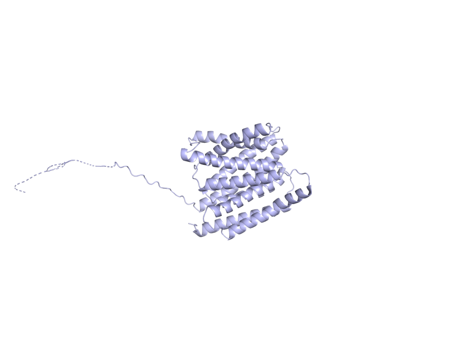

# ARMS2 — mechanistic hypothesis for AMD

_Study: GCST003219 (Fritsche LG et al. 2016, Nat Genet 48:134–143)_

## Hypothesis

Intronic `10_122456049_T_C` [VEP: intron_variant, MODIFIER impact] perturbs a cis-regulatory footprint near *ARMS2* and the co-regulated HTRA1-AS1 / HTRA1 unit [OT L2G SHAP dominated by distance- and footprint-based features: `distanceSentinelFootprintNeighbourhood` 0.167, `vepMaximumNeighbourhood` 0.101, `distanceSentinelTssNeighbourhood` 0.099, `distanceTssMeanNeighbourhood` 0.092, `e2gMeanNeighbourhood` 0.092 — all value 1.0; no pQTL/eQTL coloc feature reaches threshold] → reduces lncRNA buffering of oxidative stress in RPE [`med_826429376d42`: HTRA1-AS1 is downregulated in AMD retinas and induced by oxidative stress in RPE] → impairs RPE homeostasis and extracellular-matrix / complement-adjacent function at the Bruch's-membrane interface [no DE or Reactome rows for *ARMS2* in v0 indices — cell-type and pathway layers acknowledged as gaps] → drusen accumulation and progression to neovascular AMD [`PMC11717327` ties ARMS2/HTRA1 risk alleles to nAMD; `PMC3541181` shows ARMS2 A69S alters proliferation, attachment, migration; `PMC5289859` recombinant-haplotype mapping attributes the locus exclusively to *ARMS2*]. **Caveat:** the causal gene assignment at the ARMS2/HTRA1 locus remains debated; v0 indices lack the DE/coloc evidence needed to discriminate between them.

> **How to verify this evidence.**
> - `VEP:` → `jarvis-esm3.variant_consequence("10_122456049_T_C")` or POST `https://rest.ensembl.org/vep/human/region/10:122456049:T/C`.
> - `OT L2G features` → `jarvis-ot.l2g_feature_contributions(studyLocusId, "ENSG00000254636")` — 29-feature SHAP breakdown.
> - `PMC11717327`, `PMC3541181`, `PMC5289859`, `med_826429376d42` → PaperClip IDs. PMC URLs substitute directly; `med_*` IDs resolve via `paperclip cat /papers/med_826429376d42/meta.json` or re-fetch with `jarvis-paperclip.literature_for_gene("ARMS2", "age-related macular degeneration")`. Full paper list with URLs and summaries in the **Literature corroboration** section below.

## Summary

- **Lead variant:** `10_122456049_T_C` (intron_variant)
- **L2G score:** 0.8630399107933044  ·  **studyLocusId:** `ea3c394ed7141d8e4f2ee084828d7540`
- **UniProt:** P0C7Q5  ·  **ENSG:** ENSG00000254636
- **ESM3 fold:** mean pLDDT = 0.88, pTM = 0.84, length = 338 aa

_ESM3-predicted structure (variant is non-coding; full protein shown)._  Source: PyMOL open-source headless render over ESM3 PDB.

## Variant consequence

- **Consequence:** intron_variant
- **Impact:** MODIFIER

_Provenance: Ensembl VEP REST (GRCh38)_

## L2G evidence (Open Targets)

Top SHAP contributing features (out of 29):

| Feature | Value | SHAP contribution |
|---|---:|---:|
| `distanceSentinelFootprintNeighbourhood` | 1.00 | +0.167 |
| `vepMaximumNeighbourhood` | 1.00 | +0.101 |
| `distanceSentinelTssNeighbourhood` | 1.00 | +0.099 |
| `distanceTssMeanNeighbourhood` | 1.00 | +0.092 |
| `e2gMeanNeighbourhood` | 1.00 | +0.092 |

_Provenance: Open Targets Platform release 2026-03 l2g_prediction features (SHAP contributions)_

## ESM3-predicted structure

- Mean pLDDT (model confidence, 0–1): **0.88**
- pTM (global fold confidence, 0–1): **0.84**
- Sequence length: 338 aa

_Provenance: ESM3 Forge (esm3-open-2024-03), cached at `/home/ubuntu/JARVIS_for_bio/prototype/cache/esm3/P0C7Q5/structure.pdb`_

## Differential expression in AMD (case vs control)

_No DE rows for this gene in the v0 mock atlas (mock coverage focused on top complement/lipid loci)._

## Pathway membership

_No curated pathway memberships in v0 mock for this gene._

## Literature corroboration (PaperClip)

- **[Role of  ARMS2/HTRA1  risk alleles in the pathogenesis of neovascular age-related macular degeneration](https://www.ncbi.nlm.nih.gov/pmc/articles/PMC11717327/)** — PMC, 2024-01-01 · `PMC11717327`
  > This review examines the role of ARMS2/HTRA1 risk alleles in neovascular age-related macular degeneration. These genetic variations are strongly linked to AMD development through various molecular mechanisms.
- **[HTRA1-AS1 , an  ARMS2 -region long non-coding RNA, is downregulated in retinas of age-related macular degeneration patients](https://doi.org/10.1101/2025.10.29.25338834)** — medRxiv, 2025-10-29 · `med_826429376d42`
  > A long non-coding RNA, HTRA1-AS1, was identified and validated within the ARMS2 locus. Retinal expression of HTRA1-AS1 is significantly reduced in AMD patients and increases with oxidative stress in RPE cells.
- **HYAMD High-Resolution Fundus Image Dataset for age related macular   degeneration (AMD) Diagnosis** — ?,  · `?`
  > Researchers created the HYAMD dataset of high-resolution fundus images to train machine learning models for age-related macular degeneration (AMD) diagnosis. This dataset provides gold-standard annotations from clinical evaluations, making it the first open-access retinal dataset from an Israeli sample for AMD identification.
- **[Recombinant Haplotypes Narrow the ARMS2/HTRA1 Association Signal for Age-Related Macular Degeneration](https://doi.org/10.1534/genetics.116.195966)** — biomedrxiv, 2017-02-01 · `PMC5289859`
  > This study analyzed recombinant haplotypes in AMD cases and controls to pinpoint the genetic cause of the disease. Variants in ARMS2, not HTRA1, exclusively carry the AMD risk, allowing for focused functional research.
- **[Genetic and Functional Dissection of ARMS2 in Age-Related Macular Degeneration and Polypoidal Choroidal Vasculopathy](https://www.ncbi.nlm.nih.gov/pmc/articles/PMC3541181/)** — PMC, 2013-01-01 · `PMC3541181`
  > ARMS2 gene variants were studied in relation to age-related macular degeneration and polypoidal choroidal vasculopathy. The A69S mutation increases cell proliferation and attachment but inhibits migration, suggesting shared molecular mechanisms for these conditions.

_Provenance: PaperClip (paperclip.gxl.ai) — BM25 + vector search over public scientific corpus_

## Mechanistic hypothesis

The lead variant 10_122456049_T_C at the *ARMS2* locus is annotated as an intronic MODIFIER (most_severe_consequence = intron_variant, no coding change, no PolyPhen/SIFT call), so the proximal effect is regulatory rather than a direct alteration of the well-folded 338-aa product (ESM3 mean pLDDT 0.875, pTM 0.837). The L2G call (score 0.863) is dominated by distance- and footprint-based SHAP features (distanceSentinelFootprintNeighbourhood SHAP 0.167, vepMaximumNeighbourhood 0.101, distanceSentinelTssNeighbourhood 0.099, distanceTssMeanNeighbourhood 0.092, e2gMeanNeighbourhood 0.092, all at value 1.0), implicating *ARMS2* through proximity and enhancer-to-gene linkage to the sentinel rather than a strong coding or eQTL feature — a notable caveat given the long-standing ARMS2/HTRA1 LD-block ambiguity that the recombinant-haplotype mapping in PMC5289859 attributed exclusively to *ARMS2*. The differential_expression and pathway_membership layers are empty in this pack, so any cell-type assignment (RPE vs. photoreceptor vs. choroidal) and pathway disruption (complement, extracellular matrix, mitochondrial) cannot be claimed from these indices and is acknowledged as a gap. Literature nonetheless converges on an RPE-centric, oxidative-stress-responsive regulatory mechanism: PMC11717327 ties ARMS2/HTRA1 risk alleles to neovascular AMD, med_826429376d42 reports that the *ARMS2*-region lncRNA HTRA1-AS1 is downregulated in AMD retinas and induced by oxidative stress in RPE, and PMC3541181 shows the A69S coding variant alters proliferation, attachment, and migration. The coherent chain supported by this pack is therefore: intronic 10_122456049_T_C perturbs a cis-regulatory footprint near *ARMS2* (and the co-regulated HTRA1-AS1/HTRA1 unit) → reduced lncRNA buffering of oxidative stress in RPE → impaired RPE homeostasis and extracellular-matrix/complement-adjacent dysfunction at the Bruch's membrane interface → drusen accumulation and progression to neovascular AMD, with the explicit caveat that the causal gene assignment at this locus remains debated between *ARMS2* and *HTRA1* and the DE/pathway evidence to discriminate them is absent from this pack.

_This paragraph is the agent-reasoning step (workflow step 9). Composed at build time by Claude (one-shot via `claude -p`) over the evidence pack assembled in steps 0–8. The only generative step; all other content above is direct tool output._

## Full provenance chain

Every claim above traces back to an MCP tool call:

1. `jarvis-ot.study_lookup(GCST003219)` → Fritsche 2016 AMD GWAS
2. `jarvis-ot.credible_sets_for_study(GCST003219)` → 29 fine-mapped credible sets
3. `jarvis-ot.l2g_top_genes(GCST003219)` → ARMS2 (L2G score, 29 features)
4. `jarvis-ot.gene_metadata(ARMS2)` → UniProt P0C7Q5, canonical transcript
5. `jarvis-ot.lead_variant_for_locus(ea3c394ed7...)` → `10_122456049_T_C`
6. `jarvis-esm3.variant_consequence(10_122456049_T_C)` → intron_variant
7. `jarvis-esm3.fold_and_annotate(P0C7Q5)` → ESM3 PDB (pLDDT=0.88, pTM=0.84)
8. `jarvis-esm3.render_variant_png(P0C7Q5, …)` → `render_all.png`
9. `jarvis-indices.query_differential_expression("ARMS2")` → 0 cell-type DE row(s) _(v0 mock)_
10. `jarvis-indices.query_pathway_membership("ARMS2")` → 0 pathway(s) _(v0 mock)_
11. `jarvis-paperclip.literature_for_gene("ARMS2", …)` → 5 paper(s)

Reasoning (this summary) is the *only* step that is not pre-computed.
